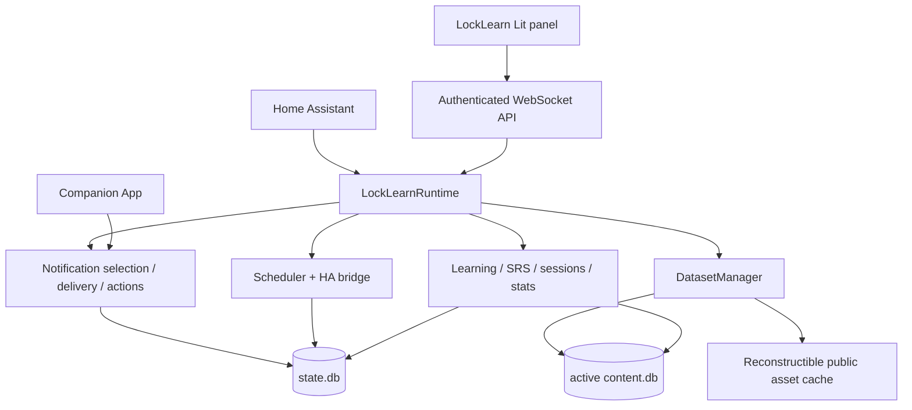

# Architecture

`SPEC_V1.md` is normative. This document describes the current V1 implementation.

## System view

## Runtime boundary

One Home Assistant config entry owns one `LockLearnRuntime`. Runtime creation opens
SQLite storage, loads bundled dataset/trust policy through HA executor jobs, creates
domain services, bridges scheduler/notifications to Home Assistant, and registers
authenticated WebSocket surfaces.

Backend ACL is authoritative. The panel only reflects permissions returned by the
backend and is never a security boundary.

## Backend

The backend is asynchronous Python. Domain logic lives under
`custom_components/locklearn/core/`; Home Assistant bridges, dataset transport,
notification integration and WebSocket plumbing are kept outside the generic core.

Time-sensitive domain services use the injectable `Clock` abstraction. P6.8 CI
rejects direct wall-clock access from core modules outside `core/clock.py`.

SQLite calls are kept off the Home Assistant event loop. Writes are serialized and
readers use the storage layer's thread-confined access patterns.

## Frontend

The panel is TypeScript + Lit, built with Vite and served as a versioned static
Home Assistant panel. The frontend/backend application contract is Home Assistant
WebSocket plus `FRONTEND_PROTOCOL_VERSION`.

Routes currently include Home, Learn, Quiz, Exam, Stats, Profiles, Tracks, Packs,
Sources and Settings. Access to owner-only UI does not replace backend ACL.

Rich dataset content is rendered from a strict typed/allowlisted AST. Arbitrary
dataset HTML and `unsafeHTML` are forbidden.

## Databases

LockLearn deliberately separates:

- `state.db`: private mutable user/runtime state;
- immutable generated `content.db`: public/reconstructible content catalog.

No SQL foreign key crosses the two databases. Cross-domain references are checked
by application integrity services.

See `DATABASE.md` and generated contracts under `docs/generated/`.

## Scheduler and notifications

The scheduler materializes generic future slots, not pedagogical content. Content
selection happens near send time so current progress and constraints remain
authoritative.

Notification delivery is target/capability-aware and platform-specific. Companion
actions are authenticated inputs that are normalized into pedagogical signals; a
notification action never bypasses Profile ACL or SRS signal policy.

See `SCHEDULER.md` and `NOTIFICATIONS.md`.

## Authentication and permissions

Home Assistant authenticates the WebSocket connection. LockLearn then applies its
own Profile owner/editor/viewer ACL, Track/Profile ownership resolution, Session
authorization, HA-admin gates for global mutations, and owner-bound capabilities
for private transfers/operations.

See `PERMISSIONS.md` and `API.md`.

## Packs and datasets

Datasets are signed prebuilt artifacts. The runtime verifies size/checksum,
Ed25519 signature, manifest/schema/license/provenance rules and hostile-archive
limits before building a new immutable content generation and atomically switching
it active.

Tracks pin immutable PackVersions explicitly; dataset update never silently changes
a Track's learning scope.

See `PACK_FORMAT.md`, `DATA_SOURCES.md`, `DATA_UPDATES.md` and
`LICENSING.md`.
