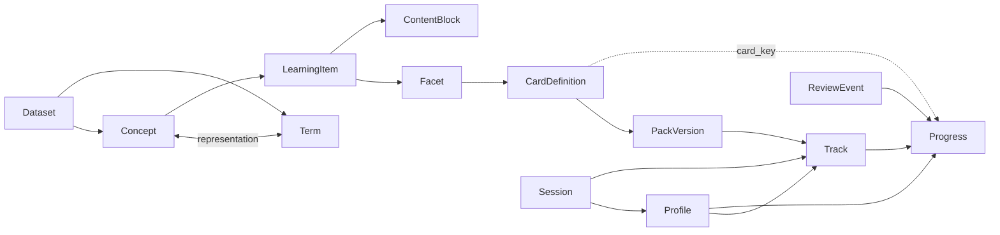

# Data model

`SPEC_V1.md` defines semantics; Python domain types and SQLite schemas implement
them. Stable content identity must never depend on display text or translations.

## Content concepts

### Concept

A source-native semantic unit. LockLearn does not merge Concepts from independent
sources merely because gloss text looks similar.

### Term

A linguistic representation identified independently from Concept. It carries a
BCP 47 language tag, optional script and versioned normalized text.

### LearningItem

The pedagogical unit a learner can encounter. It references one or more Concepts,
a generic content type, tags, optional register and prerequisite LearningItems.

Example: one vocabulary LearningItem may connect a Japanese lexical Concept to
prompt/answer Facets without making Japanese behavior part of the core.

### Facet

One addressable face of a LearningItem: text, image, audio or structured content.
Facet IDs are stable.

### CardDefinition

The exact tested skill:

```text
LearningItem + prompt_facet_id + answer_facet_id
```

`card_key` and `card_definition_id` are deterministic SHA-256-derived identities
from that immutable tuple. Grading policy, Pack membership and display text do not
participate in the identity.

### ContentBlock

Ordered presentation material with semantic role (prompt, answer, hint, example,
mnemonic, metadata), reveal semantics and a strict payload format. Rich text is a
bounded allowlisted AST; raw dataset HTML is not supported.

### Pack / PackVersion

A Pack is a curated learning collection; PackVersion is immutable. It owns ordering,
prerequisites, unlock conditions, default card enablement and confusable-group
spacing. Tracks pin a specific PackVersion.

### Dataset

A versioned signed content corpus with explicit source snapshots, licenses and
per-object provenance. Dataset version is independent from LockLearn software
version.

## User/runtime model

### Profile

A LockLearn learner identity. It is not a Home Assistant User and can be shared.
HA users become Profile members as owner/editor/viewer.

### Track

A Profile-specific learning configuration pinned to a PackVersion. Track settings
own language direction, card rules, content weights, priority and planning demand.

### Progress

Mutable projection for one `(profile_id, track_id, card_key)`. States are:
`new`, `learning`, `review`, `relearning`, `leech`. User state
(active/known/suspended/buried) is separate from SRS state.

### ReviewEvent

Append-oriented evidence/audit record containing exact card identity, signal
quality, policy/content versions and pre/post Progress snapshots. Progress can be
rebuilt from ReviewEvents.

### Session

Persistent resumable active-learning/quiz session with optimistic version/CAS,
prepared questions and immutable answer attempts.

## Relationships



For exact table-level relationships see `docs/generated/STATE_DB.md` and
`docs/generated/CONTENT_DB.md`.
