# content.db generated contract

> Generated by `scripts/generate_docs_contracts.py`. Do not edit by hand.
> Source: `custom_components/locklearn/storage/schema.py` / `CONTENT_SCHEMA`.

## ER diagram

```mermaid
erDiagram
    assets_metadata ||--o{ facet_assets : references
    card_definitions ||--o{ card_context_hints : references
    card_definitions ||--o{ card_definitions : references
    concepts ||--o{ concept_terms : references
    concepts ||--o{ learning_item_concepts : references
    confusable_groups ||--o{ confusable_group_items : references
    dataset_licenses ||--o{ assets_metadata : references
    dataset_licenses ||--o{ provenance_records : references
    dataset_versions ||--o{ dataset_packages : references
    datasets ||--o{ assets_metadata : references
    datasets ||--o{ concepts : references
    datasets ||--o{ dataset_licenses : references
    datasets ||--o{ dataset_packages : references
    datasets ||--o{ dataset_sources : references
    datasets ||--o{ dataset_versions : references
    datasets ||--o{ learning_items : references
    datasets ||--o{ packs : references
    datasets ||--o{ provenance_records : references
    datasets ||--o{ stable_id_migrations : references
    datasets ||--o{ terms : references
    datasets ||--o{ tombstones : references
    facets ||--o{ card_context_hints : references
    facets ||--o{ card_definitions : references
    facets ||--o{ facet_assets : references
    facets ||--o{ facets : references
    learning_items ||--o{ card_definitions : references
    learning_items ||--o{ confusable_group_items : references
    learning_items ||--o{ content_blocks : references
    learning_items ||--o{ facets : references
    learning_items ||--o{ learning_item_concepts : references
    learning_items ||--o{ learning_item_requirements : references
    learning_items ||--o{ learning_item_tags : references
    learning_items ||--o{ learning_items : references
    learning_items ||--o{ pack_items : references
    licenses ||--o{ assets_metadata : references
    licenses ||--o{ dataset_licenses : references
    licenses ||--o{ provenance_records : references
    licenses ||--o{ sources : references
    pack_items ||--o{ pack_item_card_defaults : references
    pack_items ||--o{ pack_item_prerequisites : references
    pack_items ||--o{ pack_item_unlock_conditions : references
    pack_versions ||--o{ confusable_groups : references
    pack_versions ||--o{ pack_items : references
    pack_versions ||--o{ pack_version_content_type_counts : references
    pack_versions ||--o{ pack_version_stats : references
    pack_versions ||--o{ pack_version_tag_counts : references
    packs ||--o{ pack_versions : references
    source_snapshots ||--o{ provenance_records : references
    sources ||--o{ concepts : references
    sources ||--o{ dataset_sources : references
    sources ||--o{ source_snapshots : references
    tags ||--o{ learning_item_tags : references
    tags ||--o{ pack_version_tag_counts : references
    terms ||--o{ concept_terms : references
```



## Tables

### `schema_version`

```sql
CREATE TABLE IF NOT EXISTS schema_version (
    singleton INTEGER PRIMARY KEY CHECK (singleton = 1),
    version INTEGER NOT NULL CHECK (version >= 1)
);
```

### `generation_metadata`

```sql
CREATE TABLE IF NOT EXISTS generation_metadata (
    singleton INTEGER PRIMARY KEY CHECK (singleton = 1),
    generation_id TEXT NOT NULL UNIQUE,
    content_schema_version INTEGER NOT NULL CHECK (content_schema_version >= 1),
    built_at_utc TEXT NOT NULL,
    parent_generation_id TEXT,
    package_count INTEGER NOT NULL CHECK (package_count >= 0),
    package_set_hash TEXT NOT NULL
);
```

### `licenses`

```sql
CREATE TABLE IF NOT EXISTS licenses (
    license_id TEXT PRIMARY KEY,
    spdx_or_internal_id TEXT NOT NULL,
    name TEXT NOT NULL,
    version TEXT NOT NULL,
    commercial_use_allowed INTEGER NOT NULL CHECK (commercial_use_allowed IN (0, 1)),
    derivatives_allowed INTEGER NOT NULL CHECK (derivatives_allowed IN (0, 1)),
    share_alike INTEGER NOT NULL CHECK (share_alike IN (0, 1)),
    attribution_required INTEGER NOT NULL CHECK (attribution_required IN (0, 1)),
    source_url TEXT NOT NULL,
    notes TEXT NOT NULL
);
```

### `sources`

```sql
CREATE TABLE IF NOT EXISTS sources (
    source_id TEXT PRIMARY KEY,
    name TEXT NOT NULL,
    provider TEXT NOT NULL,
    homepage TEXT NOT NULL,
    license_id TEXT NOT NULL REFERENCES licenses(license_id),
    attribution_template TEXT NOT NULL,
    adapter_id TEXT NOT NULL,
    refresh_policy TEXT NOT NULL,
    commercial_compatible INTEGER NOT NULL CHECK (commercial_compatible IN (0, 1)),
    notes TEXT NOT NULL
);
```

### `source_snapshots`

```sql
CREATE TABLE IF NOT EXISTS source_snapshots (
    snapshot_id TEXT PRIMARY KEY,
    source_id TEXT NOT NULL REFERENCES sources(source_id),
    upstream_version TEXT NOT NULL,
    upstream_date TEXT,
    retrieved_at TEXT NOT NULL,
    source_url TEXT NOT NULL,
    sha256 TEXT NOT NULL CHECK (length(sha256) = 64),
    adapter_version TEXT NOT NULL
);
```

Indexes:

- `source_snapshots_source_retrieved` on `source_id, retrieved_at`

### `datasets`

```sql
CREATE TABLE IF NOT EXISTS datasets (dataset_id TEXT PRIMARY KEY);
```

### `dataset_sources`

```sql
CREATE TABLE IF NOT EXISTS dataset_sources (
    dataset_id TEXT NOT NULL REFERENCES datasets(dataset_id),
    source_id TEXT NOT NULL REFERENCES sources(source_id),
    PRIMARY KEY(dataset_id, source_id)
);
```

### `dataset_licenses`

```sql
CREATE TABLE IF NOT EXISTS dataset_licenses (
    dataset_id TEXT NOT NULL REFERENCES datasets(dataset_id),
    license_id TEXT NOT NULL REFERENCES licenses(license_id),
    license_scope TEXT NOT NULL CHECK (
        license_scope IN ('editorial', 'dataset', 'asset')
    ),
    PRIMARY KEY(dataset_id, license_id, license_scope)
);
```

### `dataset_versions`

```sql
CREATE TABLE IF NOT EXISTS dataset_versions (
    dataset_version_id TEXT PRIMARY KEY,
    dataset_id TEXT NOT NULL REFERENCES datasets(dataset_id),
    version TEXT NOT NULL,
    built_at_utc TEXT NOT NULL,
    canonical_content_hash TEXT NOT NULL,
    UNIQUE(dataset_id, version)
);
```

### `dataset_packages`

```sql
CREATE TABLE IF NOT EXISTS dataset_packages (
    package_id TEXT PRIMARY KEY,
    dataset_id TEXT NOT NULL REFERENCES datasets(dataset_id),
    dataset_version_id TEXT NOT NULL REFERENCES dataset_versions(dataset_version_id),
    built_at_utc TEXT NOT NULL,
    canonical_content_hash TEXT NOT NULL,
    UNIQUE(dataset_id)
);
```

### `provenance_records`

```sql
CREATE TABLE IF NOT EXISTS provenance_records (
    provenance_id TEXT PRIMARY KEY,
    dataset_id TEXT NOT NULL REFERENCES datasets(dataset_id),
    object_type TEXT NOT NULL CHECK (
        object_type IN ('dataset', 'concept', 'term', 'learning_item', 'content_block', 'pack', 'asset')
    ),
    object_id TEXT NOT NULL,
    source_snapshot_id TEXT NOT NULL REFERENCES source_snapshots(snapshot_id),
    license_id TEXT NOT NULL REFERENCES licenses(license_id),
    license_scope TEXT NOT NULL CHECK (
        license_scope IN ('editorial', 'dataset', 'asset')
    ),
    source_record_id TEXT,
    author TEXT,
    language_tag TEXT,
    modified_from_source INTEGER NOT NULL CHECK (modified_from_source IN (0, 1)),
    attribution_text TEXT,
    FOREIGN KEY(dataset_id, license_id, license_scope)
        REFERENCES dataset_licenses(dataset_id, license_id, license_scope),
    UNIQUE(object_type, object_id, source_snapshot_id, license_id, license_scope)
);
```

Indexes:

- `provenance_dataset_object` on `dataset_id, object_type, object_id`
- `provenance_snapshot` on `source_snapshot_id`

### `concepts`

```sql
CREATE TABLE IF NOT EXISTS concepts (
    concept_id TEXT PRIMARY KEY,
    dataset_id TEXT NOT NULL REFERENCES datasets(dataset_id),
    source_id TEXT NOT NULL REFERENCES sources(source_id),
    source_record_id TEXT NOT NULL,
    source_sense_id TEXT,
    concept_type TEXT NOT NULL CHECK (
        concept_type IN ('lexical', 'grammar', 'pedagogical', 'custom')
    )
);
```

Indexes:

- `concepts_dataset` on `dataset_id`

### `terms`

```sql
CREATE TABLE IF NOT EXISTS terms (
    term_id TEXT PRIMARY KEY,
    dataset_id TEXT NOT NULL REFERENCES datasets(dataset_id),
    language_tag TEXT NOT NULL,
    script TEXT,
    text TEXT NOT NULL,
    normalized_text TEXT,
    normalization_version INTEGER,
    CHECK (
        (normalized_text IS NULL AND normalization_version IS NULL)
        OR (normalized_text IS NOT NULL AND normalization_version >= 1)
    )
);
```

Indexes:

- `terms_language_normalized` on `language_tag, normalized_text`

### `concept_terms`

```sql
CREATE TABLE IF NOT EXISTS concept_terms (
    concept_id TEXT NOT NULL REFERENCES concepts(concept_id),
    term_id TEXT NOT NULL REFERENCES terms(term_id),
    PRIMARY KEY(concept_id, term_id)
);
```

Indexes:

- `concept_terms_concept_term` on `concept_id, term_id`

### `learning_items`

```sql
CREATE TABLE IF NOT EXISTS learning_items (
    learning_item_id TEXT PRIMARY KEY,
    dataset_id TEXT NOT NULL REFERENCES datasets(dataset_id),
    content_type TEXT NOT NULL CHECK (
        content_type IN (
            'vocabulary', 'kanji', 'grammar', 'expression',
            'sentence', 'culture', 'conjugation', 'custom'
        )
    ),
    register TEXT,
    lifecycle_status TEXT NOT NULL DEFAULT 'active' CHECK (
        lifecycle_status IN ('active', 'removed', 'superseded')
    ),
    superseded_by_learning_item_id TEXT REFERENCES learning_items(learning_item_id),
    CHECK (
        (lifecycle_status = 'superseded' AND superseded_by_learning_item_id IS NOT NULL)
        OR (lifecycle_status != 'superseded' AND superseded_by_learning_item_id IS NULL)
    )
);
```

Indexes:

- `learning_items_content_type` on `content_type`
- `learning_items_dataset_status` on `dataset_id, lifecycle_status`

### `learning_item_concepts`

```sql
CREATE TABLE IF NOT EXISTS learning_item_concepts (
    learning_item_id TEXT NOT NULL REFERENCES learning_items(learning_item_id),
    concept_id TEXT NOT NULL REFERENCES concepts(concept_id),
    PRIMARY KEY(learning_item_id, concept_id)
);
```

### `learning_item_requirements`

```sql
CREATE TABLE IF NOT EXISTS learning_item_requirements (
    learning_item_id TEXT NOT NULL REFERENCES learning_items(learning_item_id),
    required_learning_item_id TEXT NOT NULL REFERENCES learning_items(learning_item_id),
    PRIMARY KEY(learning_item_id, required_learning_item_id),
    CHECK (learning_item_id != required_learning_item_id)
);
```

### `facets`

```sql
CREATE TABLE IF NOT EXISTS facets (
    facet_id TEXT PRIMARY KEY,
    learning_item_id TEXT NOT NULL REFERENCES learning_items(learning_item_id),
    kind TEXT NOT NULL CHECK (kind IN ('text', 'image', 'audio', 'structured')),
    facet_key TEXT NOT NULL,
    language_tag TEXT,
    script TEXT,
    lifecycle_status TEXT NOT NULL DEFAULT 'active' CHECK (
        lifecycle_status IN ('active', 'removed', 'superseded')
    ),
    superseded_by_facet_id TEXT REFERENCES facets(facet_id),
    UNIQUE(learning_item_id, facet_key),
    CHECK (
        (lifecycle_status = 'superseded' AND superseded_by_facet_id IS NOT NULL)
        OR (lifecycle_status != 'superseded' AND superseded_by_facet_id IS NULL)
    )
);
```

Indexes:

- `facets_learning_item` on `learning_item_id, lifecycle_status`

### `assets_metadata`

```sql
CREATE TABLE IF NOT EXISTS assets_metadata (
    asset_id TEXT PRIMARY KEY,
    dataset_id TEXT NOT NULL REFERENCES datasets(dataset_id),
    kind TEXT NOT NULL CHECK (kind IN ('image', 'audio')),
    path TEXT NOT NULL,
    sha256 TEXT NOT NULL CHECK (length(sha256) = 64),
    byte_size INTEGER NOT NULL CHECK (byte_size > 0),
    mime_type TEXT NOT NULL,
    width INTEGER,
    height INTEGER,
    license_id TEXT NOT NULL REFERENCES licenses(license_id),
    license_scope TEXT NOT NULL DEFAULT 'asset' CHECK (license_scope = 'asset'),
    attribution TEXT NOT NULL,
    FOREIGN KEY(dataset_id, license_id, license_scope)
        REFERENCES dataset_licenses(dataset_id, license_id, license_scope),
    UNIQUE(dataset_id, path),
    CHECK (
        (kind = 'image' AND width IS NOT NULL AND width > 0
                        AND height IS NOT NULL AND height > 0)
        OR (kind = 'audio' AND width IS NULL AND height IS NULL)
    )
);
```

Indexes:

- `assets_metadata_dataset_path` on `dataset_id, path`
- `assets_metadata_dataset_kind` on `dataset_id, kind`

### `facet_assets`

```sql
CREATE TABLE IF NOT EXISTS facet_assets (
    facet_id TEXT PRIMARY KEY REFERENCES facets(facet_id),
    asset_id TEXT NOT NULL REFERENCES assets_metadata(asset_id)
);
```

Indexes:

- `facet_assets_asset` on `asset_id`

### `card_definitions`

```sql
CREATE TABLE IF NOT EXISTS card_definitions (
    card_definition_id TEXT PRIMARY KEY,
    card_key TEXT NOT NULL UNIQUE,
    learning_item_id TEXT NOT NULL REFERENCES learning_items(learning_item_id),
    prompt_facet_id TEXT NOT NULL REFERENCES facets(facet_id),
    answer_facet_id TEXT NOT NULL REFERENCES facets(facet_id),
    answer_semantics TEXT NOT NULL CHECK (
        answer_semantics IN (
            'single_value', 'set_of_valid_values', 'ordered_sequence',
            'free_text', 'reserved_rule_based'
        )
    ),
    grading_policy_kind TEXT NOT NULL CHECK (
        grading_policy_kind IN ('exact', 'any_of', 'fuzzy_normalized', 'rule_based_reserved')
    ),
    grading_policy_version INTEGER NOT NULL CHECK (grading_policy_version >= 1),
    lifecycle_status TEXT NOT NULL DEFAULT 'active' CHECK (
        lifecycle_status IN ('active', 'removed', 'superseded')
    ),
    superseded_by_card_definition_id TEXT REFERENCES card_definitions(card_definition_id),
    UNIQUE(learning_item_id, prompt_facet_id, answer_facet_id),
    CHECK (prompt_facet_id != answer_facet_id),
    CHECK (
        (lifecycle_status = 'superseded' AND superseded_by_card_definition_id IS NOT NULL)
        OR (lifecycle_status != 'superseded' AND superseded_by_card_definition_id IS NULL)
    )
);
```

Indexes:

- `card_definitions_item_facets` on `learning_item_id, prompt_facet_id, answer_facet_id`
- `card_definitions_status_key` on `lifecycle_status, card_key`

### `card_context_hints`

```sql
CREATE TABLE IF NOT EXISTS card_context_hints (
    card_definition_id TEXT NOT NULL REFERENCES card_definitions(card_definition_id),
    facet_id TEXT NOT NULL REFERENCES facets(facet_id),
    position INTEGER NOT NULL CHECK (position >= 0),
    PRIMARY KEY(card_definition_id, facet_id),
    UNIQUE(card_definition_id, position)
);
```

### `content_blocks`

```sql
CREATE TABLE IF NOT EXISTS content_blocks (
    content_block_id TEXT PRIMARY KEY,
    learning_item_id TEXT NOT NULL REFERENCES learning_items(learning_item_id),
    position INTEGER NOT NULL CHECK (position >= 0),
    kind TEXT NOT NULL CHECK (kind IN ('text', 'rich_text', 'image', 'audio')),
    role TEXT NOT NULL CHECK (
        role IN ('prompt', 'answer', 'hint', 'example', 'mnemonic', 'metadata')
    ),
    reveals_answer INTEGER NOT NULL CHECK (reveals_answer IN (0, 1)),
    mask_strategy TEXT NOT NULL CHECK (
        mask_strategy IN (
            'none', 'hide_block', 'blank_term', 'blank_span', 'replace_with_placeholder'
        )
    ),
    payload_json TEXT NOT NULL,
    UNIQUE(learning_item_id, position)
);
```

### `tags`

```sql
CREATE TABLE IF NOT EXISTS tags (tag_id TEXT PRIMARY KEY, label TEXT);
```

### `learning_item_tags`

```sql
CREATE TABLE IF NOT EXISTS learning_item_tags (
    learning_item_id TEXT NOT NULL REFERENCES learning_items(learning_item_id),
    tag_id TEXT NOT NULL REFERENCES tags(tag_id),
    PRIMARY KEY(learning_item_id, tag_id)
);
```

Indexes:

- `learning_item_tags_tag_item` on `tag_id, learning_item_id`

### `packs`

```sql
CREATE TABLE IF NOT EXISTS packs (
    pack_id TEXT PRIMARY KEY,
    dataset_id TEXT NOT NULL REFERENCES datasets(dataset_id),
    name TEXT NOT NULL
);
```

### `pack_versions`

```sql
CREATE TABLE IF NOT EXISTS pack_versions (
    pack_version_id TEXT PRIMARY KEY,
    pack_id TEXT NOT NULL REFERENCES packs(pack_id),
    version TEXT NOT NULL,
    curation_policy_id TEXT,
    UNIQUE(pack_id, version)
);
```

### `pack_items`

```sql
CREATE TABLE IF NOT EXISTS pack_items (
    pack_version_id TEXT NOT NULL REFERENCES pack_versions(pack_version_id),
    learning_item_id TEXT NOT NULL REFERENCES learning_items(learning_item_id),
    position INTEGER NOT NULL CHECK (position >= 0),
    PRIMARY KEY(pack_version_id, learning_item_id),
    UNIQUE(pack_version_id, position)
);
```

Indexes:

- `pack_items_version_item` on `pack_version_id, learning_item_id`

### `pack_item_prerequisites`

```sql
CREATE TABLE IF NOT EXISTS pack_item_prerequisites (
    pack_version_id TEXT NOT NULL,
    learning_item_id TEXT NOT NULL,
    prerequisite_card_key TEXT NOT NULL,
    PRIMARY KEY(pack_version_id, learning_item_id, prerequisite_card_key),
    FOREIGN KEY(pack_version_id, learning_item_id)
        REFERENCES pack_items(pack_version_id, learning_item_id)
);
```

### `pack_item_unlock_conditions`

```sql
CREATE TABLE IF NOT EXISTS pack_item_unlock_conditions (
    pack_version_id TEXT NOT NULL,
    learning_item_id TEXT NOT NULL,
    position INTEGER NOT NULL CHECK (position >= 0),
    metric TEXT NOT NULL CHECK (metric IN ('verified_correct_count', 'mastery', 'box')),
    minimum REAL NOT NULL CHECK (minimum >= 0),
    PRIMARY KEY(pack_version_id, learning_item_id, position),
    FOREIGN KEY(pack_version_id, learning_item_id)
        REFERENCES pack_items(pack_version_id, learning_item_id)
);
```

### `pack_item_card_defaults`

```sql
CREATE TABLE IF NOT EXISTS pack_item_card_defaults (
    pack_version_id TEXT NOT NULL,
    learning_item_id TEXT NOT NULL,
    card_key TEXT NOT NULL,
    enabled_by_default INTEGER NOT NULL CHECK (enabled_by_default IN (0, 1)),
    PRIMARY KEY(pack_version_id, learning_item_id, card_key),
    FOREIGN KEY(pack_version_id, learning_item_id)
        REFERENCES pack_items(pack_version_id, learning_item_id)
);
```

### `confusable_groups`

```sql
CREATE TABLE IF NOT EXISTS confusable_groups (
    confusable_group_id TEXT PRIMARY KEY,
    pack_version_id TEXT NOT NULL REFERENCES pack_versions(pack_version_id),
    min_intro_gap_days INTEGER NOT NULL CHECK (min_intro_gap_days >= 1)
);
```

### `confusable_group_items`

```sql
CREATE TABLE IF NOT EXISTS confusable_group_items (
    confusable_group_id TEXT NOT NULL REFERENCES confusable_groups(confusable_group_id),
    learning_item_id TEXT NOT NULL REFERENCES learning_items(learning_item_id),
    PRIMARY KEY(confusable_group_id, learning_item_id)
);
```

### `stable_id_migrations`

```sql
CREATE TABLE IF NOT EXISTS stable_id_migrations (
    object_type TEXT NOT NULL CHECK (
        object_type IN (
            'concept', 'term', 'learning_item', 'facet', 'card_definition', 'card_key'
        )
    ),
    dataset_id TEXT NOT NULL REFERENCES datasets(dataset_id),
    old_id TEXT NOT NULL,
    new_id TEXT NOT NULL,
    introduced_in_version TEXT NOT NULL,
    reason TEXT NOT NULL,
    PRIMARY KEY(object_type, old_id),
    UNIQUE(object_type, new_id),
    CHECK(old_id != new_id)
);
```

### `tombstones`

```sql
CREATE TABLE IF NOT EXISTS tombstones (
    object_type TEXT NOT NULL CHECK (
        object_type IN ('learning_item', 'facet', 'card_definition')
    ),
    stable_id TEXT NOT NULL,
    dataset_id TEXT NOT NULL REFERENCES datasets(dataset_id),
    lifecycle_status TEXT NOT NULL CHECK (lifecycle_status IN ('removed', 'superseded')),
    replacement_id TEXT,
    status_since_generation_id TEXT NOT NULL,
    PRIMARY KEY(object_type, stable_id),
    CHECK (
        (lifecycle_status = 'superseded' AND replacement_id IS NOT NULL)
        OR (lifecycle_status = 'removed' AND replacement_id IS NULL)
    )
);
```

### `content_lifecycle_history`

```sql
CREATE TABLE IF NOT EXISTS content_lifecycle_history (
    object_type TEXT NOT NULL CHECK (
        object_type IN ('learning_item', 'facet', 'card_definition')
    ),
    stable_id TEXT NOT NULL,
    generation_id TEXT NOT NULL,
    lifecycle_status TEXT NOT NULL CHECK (
        lifecycle_status IN ('active', 'removed', 'superseded')
    ),
    replacement_id TEXT,
    PRIMARY KEY(object_type, stable_id, generation_id)
);
```

### `pack_version_stats`

```sql
CREATE TABLE IF NOT EXISTS pack_version_stats (
    pack_version_id TEXT PRIMARY KEY REFERENCES pack_versions(pack_version_id),
    total_items INTEGER NOT NULL CHECK (total_items >= 0),
    total_cards INTEGER NOT NULL CHECK (total_cards >= 0)
);
```

### `pack_version_content_type_counts`

```sql
CREATE TABLE IF NOT EXISTS pack_version_content_type_counts (
    pack_version_id TEXT NOT NULL REFERENCES pack_versions(pack_version_id),
    content_type TEXT NOT NULL,
    item_count INTEGER NOT NULL CHECK (item_count >= 0),
    PRIMARY KEY(pack_version_id, content_type)
);
```

### `pack_version_tag_counts`

```sql
CREATE TABLE IF NOT EXISTS pack_version_tag_counts (
    pack_version_id TEXT NOT NULL REFERENCES pack_versions(pack_version_id),
    tag_id TEXT NOT NULL REFERENCES tags(tag_id),
    item_count INTEGER NOT NULL CHECK (item_count >= 0),
    PRIMARY KEY(pack_version_id, tag_id)
);
```
