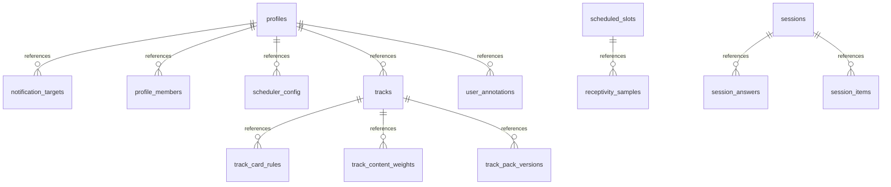

# state.db generated contract

> Generated by `scripts/generate_docs_contracts.py`. Do not edit by hand.
> Source: `custom_components/locklearn/storage/schema.py` / `STATE_SCHEMA`.

## ER diagram



## Tables

### `schema_version`

```sql
CREATE TABLE IF NOT EXISTS schema_version (version INTEGER NOT NULL);
```

### `profiles`

```sql
CREATE TABLE IF NOT EXISTS profiles (
    profile_id TEXT PRIMARY KEY,
    name TEXT NOT NULL,
    preset TEXT NOT NULL CHECK (preset IN ('child', 'standard', 'intensive', 'custom')),
    timezone TEXT NOT NULL,
    status TEXT NOT NULL DEFAULT 'active' CHECK (status IN ('active', 'archived')),
    settings_json TEXT NOT NULL DEFAULT '{}',
    created_at_utc TEXT NOT NULL,
    updated_at_utc TEXT NOT NULL
);
```

Indexes:

- `profiles_status_name` on `status, name, profile_id`

### `profile_members`

```sql
CREATE TABLE IF NOT EXISTS profile_members (
    profile_id TEXT NOT NULL REFERENCES profiles(profile_id) ON DELETE CASCADE,
    ha_user_id TEXT NOT NULL,
    role TEXT NOT NULL CHECK (role IN ('owner', 'editor', 'viewer')),
    created_at_utc TEXT NOT NULL,
    PRIMARY KEY(profile_id, ha_user_id)
);
```

Indexes:

- `profile_members_user_role` on `ha_user_id, role, profile_id`

### `tracks`

```sql
CREATE TABLE IF NOT EXISTS tracks (
    track_id TEXT PRIMARY KEY,
    profile_id TEXT NOT NULL REFERENCES profiles(profile_id) ON DELETE CASCADE,
    name TEXT NOT NULL,
    source_language TEXT,
    target_language TEXT,
    status TEXT NOT NULL DEFAULT 'active'
        CHECK (status IN ('active', 'paused', 'archived')),
    priority INTEGER NOT NULL DEFAULT 1 CHECK (priority >= 1),
    settings_json TEXT NOT NULL DEFAULT '{}',
    created_at_utc TEXT NOT NULL,
    updated_at_utc TEXT NOT NULL
);
```

Indexes:

- `tracks_profile_status` on `profile_id, status, track_id`

### `track_pack_versions`

```sql
CREATE TABLE IF NOT EXISTS track_pack_versions (
    track_id TEXT PRIMARY KEY REFERENCES tracks(track_id) ON DELETE CASCADE,
    pack_version_id TEXT NOT NULL,
    dataset_generation TEXT NOT NULL,
    integrated_at_utc TEXT NOT NULL
);
```

Indexes:

- `track_pack_versions_pack` on `pack_version_id, track_id`

### `track_card_rules`

```sql
CREATE TABLE IF NOT EXISTS track_card_rules (
    track_id TEXT NOT NULL REFERENCES tracks(track_id) ON DELETE CASCADE,
    rule_id TEXT NOT NULL,
    rule_kind TEXT NOT NULL,
    card_key TEXT,
    prompt_facet_id TEXT,
    answer_facet_id TEXT,
    rule_json TEXT NOT NULL DEFAULT '{}',
    enabled INTEGER NOT NULL DEFAULT 1 CHECK (enabled IN (0, 1)),
    PRIMARY KEY(track_id, rule_id),
    CHECK (
        (prompt_facet_id IS NULL AND answer_facet_id IS NULL)
        OR (prompt_facet_id IS NOT NULL AND answer_facet_id IS NOT NULL)
    )
);
```

Indexes:

- `track_card_rules_card` on `track_id, card_key, enabled`

### `track_content_weights`

```sql
CREATE TABLE IF NOT EXISTS track_content_weights (
    track_id TEXT NOT NULL REFERENCES tracks(track_id) ON DELETE CASCADE,
    content_type TEXT NOT NULL,
    weight REAL NOT NULL CHECK (weight >= 0),
    PRIMARY KEY(track_id, content_type)
);
```

### `notification_targets`

```sql
CREATE TABLE IF NOT EXISTS notification_targets (
    target_id TEXT PRIMARY KEY,
    profile_id TEXT NOT NULL REFERENCES profiles(profile_id) ON DELETE CASCADE,
    device_registry_id TEXT NOT NULL,
    platform TEXT NOT NULL,
    capabilities_json TEXT NOT NULL DEFAULT '{}',
    friendly_name TEXT NOT NULL,
    last_resolved_notify_service TEXT,
    shared_device INTEGER NOT NULL DEFAULT 0 CHECK (shared_device IN (0, 1)),
    lockscreen_visibility TEXT NOT NULL DEFAULT 'private'
        CHECK (lockscreen_visibility IN ('public', 'private', 'secret')),
    enabled INTEGER NOT NULL DEFAULT 1 CHECK (enabled IN (0, 1)),
    minimum_gap_seconds INTEGER CHECK (minimum_gap_seconds IS NULL OR minimum_gap_seconds >= 0),
    maximum_notifications_per_hour INTEGER
        CHECK (
            maximum_notifications_per_hour IS NULL
            OR maximum_notifications_per_hour >= 1
        ),
    daily_push_budget INTEGER CHECK (daily_push_budget IS NULL OR daily_push_budget >= 0),
    adaptive_backoff_json TEXT NOT NULL DEFAULT '{}',
    created_at_utc TEXT NOT NULL,
    updated_at_utc TEXT NOT NULL,
    UNIQUE(profile_id, device_registry_id)
);
```

Indexes:

- `notification_targets_profile_enabled` on `profile_id, enabled, target_id`

### `progress`

```sql
CREATE TABLE IF NOT EXISTS progress (
    profile_id TEXT NOT NULL,
    track_id TEXT NOT NULL,
    card_key TEXT NOT NULL,
    learning_item_id TEXT,
    prompt_facet_id TEXT,
    answer_facet_id TEXT,
    state TEXT NOT NULL CHECK (state IN ('new', 'learning', 'review', 'relearning', 'leech')),
    mastery REAL NOT NULL DEFAULT 0 CHECK (mastery >= 0 AND mastery <= 1),
    box INTEGER NOT NULL DEFAULT 0 CHECK (box >= 0),
    seen_count INTEGER NOT NULL DEFAULT 0 CHECK (seen_count >= 0),
    verified_correct_count INTEGER NOT NULL DEFAULT 0 CHECK (verified_correct_count >= 0),
    verified_wrong_count INTEGER NOT NULL DEFAULT 0 CHECK (verified_wrong_count >= 0),
    self_known_count INTEGER NOT NULL DEFAULT 0 CHECK (self_known_count >= 0),
    self_review_count INTEGER NOT NULL DEFAULT 0 CHECK (self_review_count >= 0),
    first_seen_at_utc TEXT,
    last_seen_at_utc TEXT,
    last_result TEXT,
    next_due_at_utc TEXT,
    streak_correct INTEGER NOT NULL DEFAULT 0 CHECK (streak_correct >= 0),
    leech_score REAL NOT NULL DEFAULT 0 CHECK (leech_score >= 0),
    difficulty_factor REAL NOT NULL DEFAULT 1 CHECK (difficulty_factor > 0),
    last_verified_at_utc TEXT,
    verified_success_since_box INTEGER NOT NULL DEFAULT 0
        CHECK (verified_success_since_box >= 0),
    user_state TEXT NOT NULL DEFAULT 'active'
        CHECK (user_state IN ('active', 'known_already', 'suspended', 'buried')),
    suspend_until_utc TEXT,
    example_rotation_index INTEGER NOT NULL DEFAULT 0 CHECK (example_rotation_index >= 0),
    content_status TEXT NOT NULL DEFAULT 'active'
        CHECK (content_status IN ('active', 'removed', 'superseded')),
    policy_version INTEGER NOT NULL DEFAULT 1 CHECK (policy_version >= 1),
    dataset_generation TEXT,
    normalization_version INTEGER CHECK (
        normalization_version IS NULL OR normalization_version >= 1
    ),
    updated_at_utc TEXT NOT NULL DEFAULT '',
    PRIMARY KEY(profile_id, track_id, card_key),
    CHECK (
        (learning_item_id IS NULL AND prompt_facet_id IS NULL AND answer_facet_id IS NULL)
        OR (
            learning_item_id IS NOT NULL
            AND prompt_facet_id IS NOT NULL
            AND answer_facet_id IS NOT NULL
        )
    )
);
```

Indexes:

- `progress_due` on `profile_id, track_id, state, next_due_at_utc`
- `progress_content_identity` on `card_key, learning_item_id, prompt_facet_id, answer_facet_id`

### `review_events`

```sql
CREATE TABLE IF NOT EXISTS review_events (
    id TEXT PRIMARY KEY,
    profile_id TEXT NOT NULL,
    track_id TEXT NOT NULL,
    learning_item_id TEXT NOT NULL,
    prompt_facet_id TEXT NOT NULL,
    answer_facet_id TEXT NOT NULL,
    card_key TEXT NOT NULL,
    mode TEXT NOT NULL,
    question_type TEXT NOT NULL,
    result TEXT NOT NULL,
    answer_id TEXT,
    expected_answer_id TEXT,
    hint_used INTEGER NOT NULL CHECK (hint_used IN (0, 1)),
    retrieval_occurred INTEGER NOT NULL CHECK (retrieval_occurred IN (0, 1)),
    scheduled_interval_days REAL,
    elapsed_days REAL,
    grading_result TEXT,
    signal_quality TEXT NOT NULL,
    policy_version INTEGER NOT NULL CHECK (policy_version >= 1),
    dataset_generation TEXT NOT NULL,
    normalization_version INTEGER CHECK (
        normalization_version IS NULL OR normalization_version >= 1
    ),
    pre_state_snapshot TEXT NOT NULL,
    post_state_snapshot TEXT NOT NULL,
    presentation_to_answer_ms INTEGER CHECK (
        presentation_to_answer_ms IS NULL OR presentation_to_answer_ms >= 0
    ),
    delivery_to_action_ms INTEGER CHECK (
        delivery_to_action_ms IS NULL OR delivery_to_action_ms >= 0
    ),
    session_id TEXT,
    notification_id TEXT,
    created_at_utc TEXT NOT NULL,
    local_date TEXT NOT NULL,
    timezone_name TEXT NOT NULL,
    utc_offset_minutes INTEGER NOT NULL
);
```

Indexes:

- `review_events_card_created` on `card_key, created_at_utc DESC`
- `review_events_profile_created` on `profile_id, created_at_utc DESC`
- `review_events_track_created` on `track_id, created_at_utc DESC`

### `user_annotations`

```sql
CREATE TABLE IF NOT EXISTS user_annotations (
    annotation_id TEXT PRIMARY KEY,
    profile_id TEXT NOT NULL REFERENCES profiles(profile_id) ON DELETE CASCADE,
    learning_item_id TEXT,
    card_key TEXT,
    note TEXT NOT NULL,
    created_at_utc TEXT NOT NULL,
    updated_at_utc TEXT NOT NULL,
    CHECK (learning_item_id IS NOT NULL OR card_key IS NOT NULL)
);
```

Indexes:

- `user_annotations_profile_item` on `profile_id, learning_item_id, card_key`

### `sessions`

```sql
CREATE TABLE IF NOT EXISTS sessions (
    id TEXT PRIMARY KEY,
    profile_id TEXT NOT NULL,
    track_id TEXT,
    type TEXT NOT NULL DEFAULT 'learn',
    strategy TEXT NOT NULL DEFAULT 'default',
    status TEXT NOT NULL,
    version INTEGER NOT NULL,
    current_position INTEGER NOT NULL,
    started_at_utc TEXT NOT NULL,
    last_activity_at_utc TEXT NOT NULL,
    completed_at_utc TEXT,
    question_count INTEGER NOT NULL DEFAULT 0 CHECK (question_count >= 0),
    settings_json TEXT NOT NULL DEFAULT '{}'
);
```

Indexes:

- `sessions_profile_status_activity` on `profile_id, status, last_activity_at_utc`

### `session_items`

```sql
CREATE TABLE IF NOT EXISTS session_items (
    session_id TEXT NOT NULL REFERENCES sessions(id) ON DELETE CASCADE,
    position INTEGER NOT NULL CHECK (position >= 0),
    question_id TEXT NOT NULL,
    card_key TEXT NOT NULL,
    learning_item_id TEXT NOT NULL,
    prompt_facet_id TEXT NOT NULL,
    answer_facet_id TEXT NOT NULL,
    status TEXT NOT NULL DEFAULT 'queued'
        CHECK (status IN ('queued', 'presented', 'answered', 'skipped')),
    payload_json TEXT NOT NULL DEFAULT '{}',
    PRIMARY KEY(session_id, position),
    UNIQUE(session_id, question_id)
);
```

Indexes:

- `session_items_card` on `card_key, session_id`

### `session_answers`

```sql
CREATE TABLE IF NOT EXISTS session_answers (
    id INTEGER PRIMARY KEY AUTOINCREMENT,
    session_id TEXT NOT NULL REFERENCES sessions(id) ON DELETE CASCADE,
    question_id TEXT NOT NULL,
    answer_json TEXT NOT NULL,
    resulting_version INTEGER NOT NULL,
    created_at_utc TEXT NOT NULL,
    UNIQUE(session_id, resulting_version)
);
```

### `exam_attempts`

```sql
CREATE TABLE IF NOT EXISTS exam_attempts (
    attempt_id TEXT PRIMARY KEY,
    profile_id TEXT NOT NULL,
    track_id TEXT,
    status TEXT NOT NULL CHECK (status IN ('active', 'completed', 'abandoned')),
    settings_json TEXT NOT NULL,
    question_count INTEGER NOT NULL CHECK (question_count >= 0),
    correct_count INTEGER NOT NULL DEFAULT 0 CHECK (correct_count >= 0),
    started_at_utc TEXT NOT NULL,
    completed_at_utc TEXT,
    result_json TEXT
);
```

Indexes:

- `exam_attempts_profile_started` on `profile_id, started_at_utc DESC`

### `scheduler_config`

```sql
CREATE TABLE IF NOT EXISTS scheduler_config (
    profile_id TEXT PRIMARY KEY REFERENCES profiles(profile_id) ON DELETE CASCADE,
    version INTEGER NOT NULL CHECK (version >= 1),
    timezone TEXT NOT NULL,
    active_days_json TEXT NOT NULL,
    active_windows_json TEXT NOT NULL,
    minimum_gap_seconds INTEGER NOT NULL CHECK (minimum_gap_seconds >= 0),
    maximum_notifications_per_hour INTEGER NOT NULL
        CHECK (maximum_notifications_per_hour >= 1),
    quiet_hours_json TEXT NOT NULL,
    receptive_when TEXT,
    defer_window_minutes INTEGER NOT NULL DEFAULT 0 CHECK (defer_window_minutes >= 0),
    updated_at_utc TEXT NOT NULL
);
```

### `scheduled_slots`

```sql
CREATE TABLE IF NOT EXISTS scheduled_slots (
    slot_id TEXT PRIMARY KEY,
    profile_id TEXT NOT NULL,
    track_id TEXT,
    target_id TEXT,
    slot_type TEXT NOT NULL,
    scheduled_for_utc TEXT NOT NULL,
    deferred_until_utc TEXT,
    defer_reason TEXT,
    card_key TEXT,
    learning_item_id TEXT,
    prompt_facet_id TEXT,
    answer_facet_id TEXT,
    selection_reason TEXT,
    expired_reason TEXT,
    status TEXT NOT NULL CHECK (
        status IN ('scheduled', 'deferred', 'sent', 'consumed', 'expired', 'cancelled')
    ),
    scheduler_config_version INTEGER NOT NULL CHECK (scheduler_config_version >= 1),
    seed TEXT NOT NULL,
    created_at_utc TEXT NOT NULL,
    updated_at_utc TEXT NOT NULL
);
```

Indexes:

- `scheduled_slots_profile_scheduled_status` on `profile_id, scheduled_for_utc, status`

### `notification_interactions`

```sql
CREATE TABLE IF NOT EXISTS notification_interactions (
    interaction_id TEXT PRIMARY KEY,
    token TEXT NOT NULL UNIQUE,
    tag TEXT,
    profile_id TEXT NOT NULL,
    track_id TEXT,
    target_id TEXT NOT NULL,
    card_key TEXT,
    stage TEXT NOT NULL CHECK (stage IN ('prompt', 'revealed', 'answered')),
    status TEXT NOT NULL CHECK (
        status IN ('pending', 'consumed', 'expired', 'cleared', 'replaced')
    ),
    created_at_utc TEXT NOT NULL,
    expires_at_utc TEXT NOT NULL,
    consumed_at_utc TEXT,
    action_id TEXT,
    payload_json TEXT NOT NULL DEFAULT '{}'
);
```

Indexes:

- `notification_interactions_target_status_expires` on `target_id, status, expires_at_utc`
- `notification_interactions_profile_created` on `profile_id, created_at_utc DESC`

### `receptivity_samples`

```sql
CREATE TABLE IF NOT EXISTS receptivity_samples (
    slot_id TEXT PRIMARY KEY REFERENCES scheduled_slots(slot_id) ON DELETE CASCADE,
    profile_id TEXT NOT NULL,
    target_id TEXT,
    delivered_at_utc TEXT NOT NULL,
    timezone_name TEXT NOT NULL,
    weekday INTEGER NOT NULL CHECK (weekday >= 0 AND weekday <= 6),
    local_hour INTEGER NOT NULL CHECK (local_hour >= 0 AND local_hour <= 23),
    delivered INTEGER NOT NULL DEFAULT 1 CHECK (delivered IN (0, 1)),
    cleared INTEGER NOT NULL DEFAULT 0 CHECK (cleared IN (0, 1)),
    answered INTEGER NOT NULL DEFAULT 0 CHECK (answered IN (0, 1)),
    delivery_to_action_ms INTEGER CHECK (
        delivery_to_action_ms IS NULL OR delivery_to_action_ms >= 0
    ),
    updated_at_utc TEXT NOT NULL
);
```

Indexes:

- `receptivity_samples_profile_hour` on `profile_id, weekday, local_hour, delivered_at_utc DESC`

### `stats_daily`

```sql
CREATE TABLE IF NOT EXISTS stats_daily (
    profile_id TEXT NOT NULL,
    track_id TEXT NOT NULL,
    local_date TEXT NOT NULL,
    timezone_name TEXT NOT NULL,
    utc_offset_minutes INTEGER NOT NULL,
    policy_version INTEGER NOT NULL CHECK (policy_version >= 1),
    learning_exposures INTEGER NOT NULL DEFAULT 0 CHECK (learning_exposures >= 0),
    verified_retrievals INTEGER NOT NULL DEFAULT 0 CHECK (verified_retrievals >= 0),
    self_known INTEGER NOT NULL DEFAULT 0 CHECK (self_known >= 0),
    verified_correct INTEGER NOT NULL DEFAULT 0 CHECK (verified_correct >= 0),
    verified_wrong INTEGER NOT NULL DEFAULT 0 CHECK (verified_wrong >= 0),
    quiz_total INTEGER NOT NULL DEFAULT 0 CHECK (quiz_total >= 0),
    free_text_total INTEGER NOT NULL DEFAULT 0 CHECK (free_text_total >= 0),
    hints_used INTEGER NOT NULL DEFAULT 0 CHECK (hints_used >= 0),
    new_cards INTEGER NOT NULL DEFAULT 0 CHECK (new_cards >= 0),
    reviewed_cards INTEGER NOT NULL DEFAULT 0 CHECK (reviewed_cards >= 0),
    relearning_cards INTEGER NOT NULL DEFAULT 0 CHECK (relearning_cards >= 0),
    leech_cards INTEGER NOT NULL DEFAULT 0 CHECK (leech_cards >= 0),
    active_seconds INTEGER NOT NULL DEFAULT 0 CHECK (active_seconds >= 0),
    PRIMARY KEY(profile_id, track_id, local_date)
);
```

Indexes:

- `stats_daily_profile_date` on `profile_id, local_date DESC`

### `settings`

```sql
CREATE TABLE IF NOT EXISTS settings (
    key TEXT PRIMARY KEY,
    value_json TEXT NOT NULL,
    updated_at_utc TEXT NOT NULL
);
```

### `audit_events`

```sql
CREATE TABLE IF NOT EXISTS audit_events (
    id INTEGER PRIMARY KEY AUTOINCREMENT,
    event_type TEXT NOT NULL,
    actor_user_id TEXT,
    profile_id TEXT,
    payload_json TEXT NOT NULL,
    created_at_utc TEXT NOT NULL
);
```
